# 📊 Spark & Hadoop Big Data Processing  

## 📌 Overview  

This project was developed as part of an **academic assignment** on Big Data systems.  
The goal was to implement and evaluate data processing workflows using **Apache Hadoop** and **Apache Spark** in a distributed environment.  

The tasks required us to:  
- Set up and use Hadoop & Spark on **virtual machines (VMs)** with HDFS.  
- Upload and transform datasets (CSV → Parquet).  
- Implement queries using both **RDD API** and **Spark SQL / DataFrames** (on CSV and Parquet).  
- Compare execution times and analyze performance.  
- Explore join strategies: **Broadcast Join**, **Repartition Join**, and **Catalyst Optimizer** (BroadcastHashJoin vs SortMergeJoin).  

---

## 📂 Project Structure  

```
spark-hadoop-bigdata-analysis/
├── data_ingestion/          # CSV → Parquet converters
├── queries/                 # RDD & SQL queries (CSV + Parquet)
├── joins/                   # Broadcast, Repartition, Catalyst ON/OFF
├── visualizations/          # Execution time plots
├── images/                  # Screenshots & charts for README
├── README.md
└── requirements.txt
```

---

## ⚙️ Setup  

### Requirements  
- **Virtual Machine** with Hadoop & Spark installed  
- Hadoop ≥ 3.3  
- Spark ≥ 3.5  
- HDFS accessible at `hdfs://master:9000`  
- Python 3.8+  
- Python packages:  
  ```bash
  pip install pyspark matplotlib numpy
  ```

### Dataset  
We use a subset of the **Common Crawl** dataset (WARC, WAT, WET files) plus small **employees/departments** CSV files.  

Download and load into HDFS:  

```bash
wget http://www.cslab.ece.ntua.gr/~ikons/bigdata/project2024.tar.gz
tar -xzf project2024.tar.gz

hadoop fs -mkdir -p /home/user/csv_files
hadoop fs -put warc.csv wat.csv wet.csv employees.csv departments.csv /home/user/csv_files
```

📸 Uploaded CSV files:  
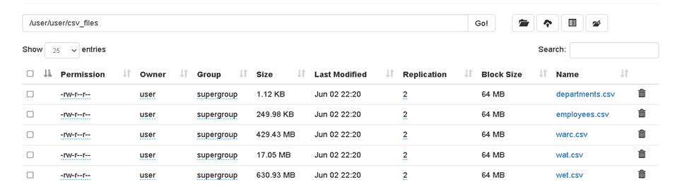  

📸 Converted Parquet files:  
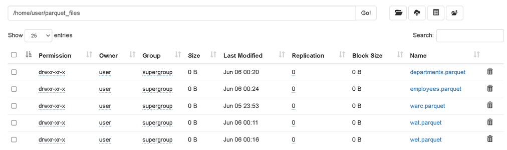  

---

## 🔎 Queries (Part 1)  

We answer five main queries using both **RDD API** and **Spark SQL (CSV & Parquet)**:  

- **Q1:** For the time range between *2017-03-22 22:00 and 2017-03-22 23:00*, find the **top 5 most used servers**, in descending order of usage.  
- **Q2:** For the target URL `http://1001.ru/articles/post/ai-da-tumin-443`, find the **metadata length** (from WAT) and the **HTML DOM size** (from WARC).  
- **Q3:** Find the top **5 (warc_record_id, target_url, content_length)** with the **largest content length**, where the server is Apache.  
- **Q4:** For each server, compute the **average WARC content length** and the **average WAT metadata length**, then return the top 5 servers by average WARC content length.  
- **Q5:** Find the **most popular target URL**, i.e. the URL that appears most often inside the HTML DOM of other records.  

📸 Example execution (RDD):  
  

📸 Example execution (Spark SQL on CSV):  
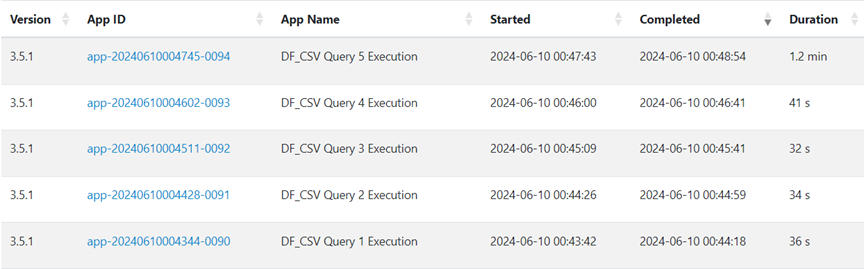  

📸 Example execution (Spark SQL on Parquet):  
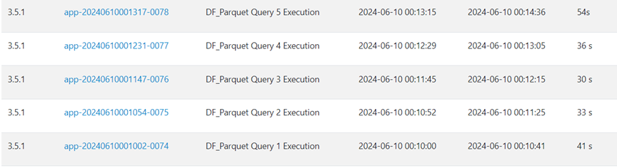  

---

## 🔗 Joins (Part 2)  

We evaluate different join strategies on the **employees.csv** and **departments.csv** datasets:  

- **Broadcast Join (RDD API):**  
  The small `departments` dataset is broadcasted to all executors and joined with `employees`.  
  📸 Example results (first 50 and 100 rows):  

  <p align="center">
    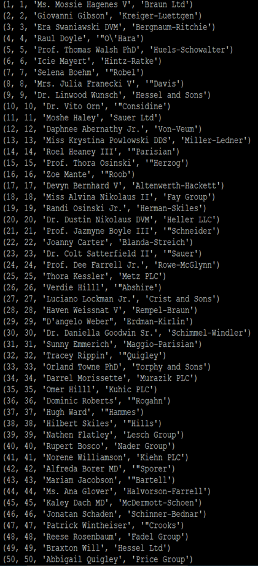
    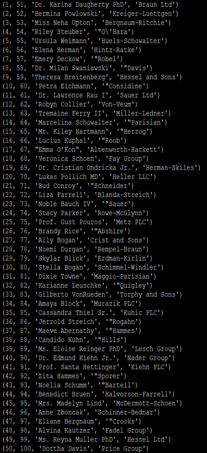
  </p>

- **Repartition Join (RDD API):**  
  Both datasets are repartitioned by department id, grouped with `cogroup`, and joined.  
  📸 Example results (first 50 and 100 rows):  

  <p align="center">
    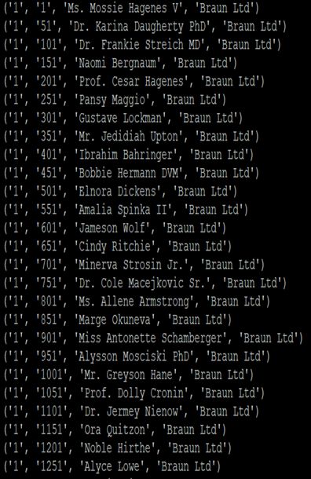
    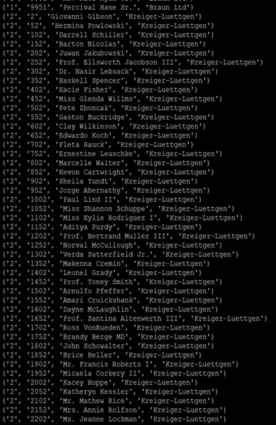
  </p>

- **Catalyst Optimizer (Spark SQL):**  
  Execution times are compared with broadcast threshold **enabled** (BroadcastHashJoin) vs **disabled** (SortMergeJoin).  

  📸 Physical plan (Catalyst enabled):  
  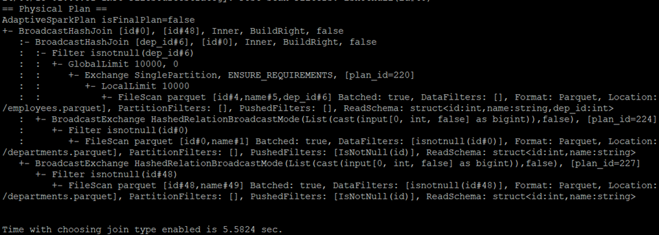  
  *Performs a series of joins between employees and departments using the Broadcast HashJoin method to optimize performance, while applying filters and data size restrictions to reduce the processing overhead.*  

  📸 Physical plan (Catalyst disabled):  
  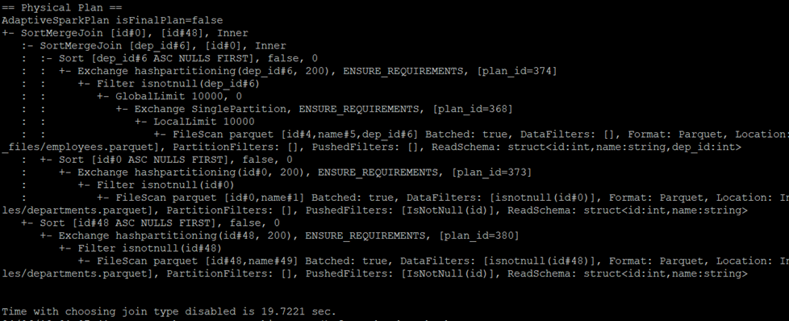  
  *Performs joins between employees and departments using the Sort-Merge Join method, which requires data sorting. For this specific query and dataset, it is less efficient compared to the Broadcast HashJoin chosen by Catalyst.*  

---

## 📈 Results & Analysis  

### Execution Times  

| Query | RDD | SQL (CSV) | SQL (Parquet) |
|-------|-----|-----------|---------------|
| Q1    | 26  | 72        | 54            |
| Q2    | 24  | 41        | 36            |
| Q3    | 14  | 32        | 30            |
| Q4    | 31  | 34        | 33            |
| Q5    | 29  | 36        | 33            |

📊 **Execution time comparison:**  
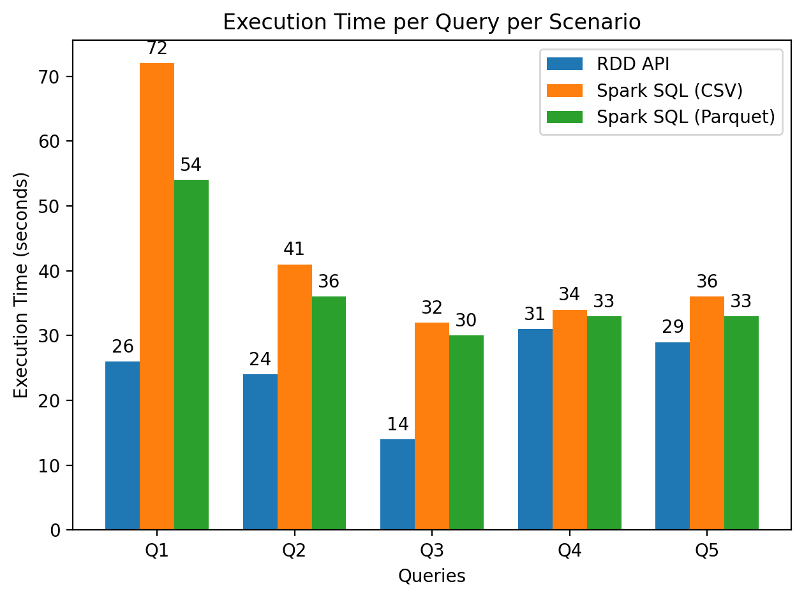  

#### Observations:  
- **RDD API (Map/Reduce):** Fastest execution times across all queries. Optimized for large-scale transformations.  
- **Spark SQL on CSV:** Slowest, due to schema inference and raw text parsing overhead.  
- **Spark SQL on Parquet:** Faster than CSV, thanks to Parquet’s columnar format and no schema inference.  

---

### Catalyst Optimizer Analysis  

- **Enabled (BroadcastHashJoin):** Spark automatically broadcasts the smaller dataset, achieving much faster execution.  
- **Disabled (SortMergeJoin):** Requires sorting of large datasets before joining, resulting in slower performance.  

📊 Catalyst join comparison:  
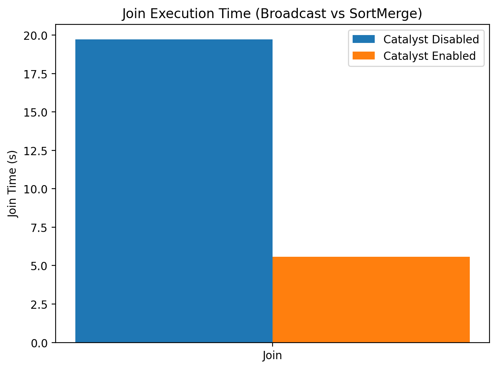  

---

## 📝 Notes  
- All computations run on **VMs** configured with Hadoop + Spark.  
- Data is stored and processed in **HDFS**.  
- The project highlights performance differences between formats (CSV vs Parquet), APIs (RDD vs SQL), and join strategies.  

---

## 📜 License  
MIT License.  
