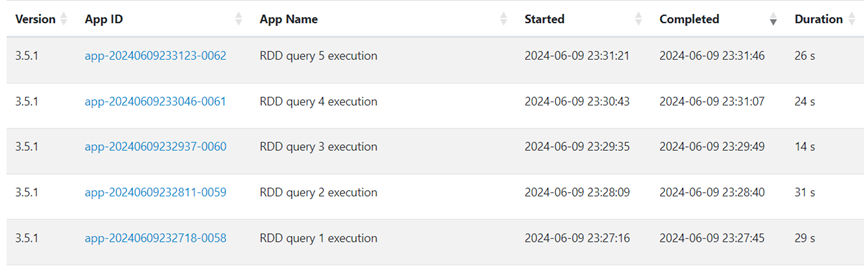

# A Comparative Analysis of Distributed Data Processing using Apache Spark and Hadoop

[]()
[]()
[]()
[]()

> A distributed data processing and performance analysis project using **Apache Spark** and **Apache Hadoop (HDFS)** — implemented as part of an academic assignment on Big Data systems.

---

## 🎯 Overview

This repository presents an **academic research project** developed as part of the university course on **Big Data Management Systems**.

The project focuses on the **design, implementation, and performance evaluation** of distributed data processing pipelines using **Apache Spark** and **Apache Hadoop (HDFS)** within a real clustered environment.  

Its primary objective is to **compare and analyze** how different **data processing approaches (RDDs and DataFrames)**, **storage formats (CSV and Parquet)**, and **join techniques** affect **execution speed, scalability, and resource efficiency** in Spark’s distributed engine.

Beyond performance benchmarking, the study provides an in-depth exploration of **Spark’s internal mechanisms** — including the **Catalyst Optimizer**, **query planning**, and **execution strategies** — to highlight how architectural and design choices affect real-world data processing outcomes.

Through systematic experimentation and analysis, this project aims to deepen the understanding of **distributed data analytics optimization** and provide useful observations on how open-source Big Data frameworks can be effectively utilized for **scalable and efficient data processing**.

---

## ✨ Key Features

- Developed and tested in a **distributed computing environment** using **HDFS**, **YARN**, and **Apache Spark 3.5.x**
- **Data ingestion and format conversion** from **CSV to Parquet** to enable faster and more efficient querying
- **Comparative performance analysis** across multiple dimensions:
  - **Processing approach:** RDD API vs Spark SQL / DataFrame API  
  - **Storage format:** CSV vs Parquet  
  - **Join strategy:** Broadcast, Repartition, and Catalyst Optimizer (BroadcastHashJoin vs SortMergeJoin)
- **Execution time evaluation**, **visual comparisons**, and **practical performance insights**

---

## 📂 Project Structure

```
spark-hadoop-bigdata-analysis/
├── data_ingestion/          # CSV → Parquet conversion and upload to HDFS
├── queries/                 
│   ├── rdd/                 # Analytical queries using Spark RDDs
│   ├── sparksql_csv/        # Analytical queries using Spark SQL on CSV data
│   └── sparksql_parquet/    # Analytical queries using Spark SQL on Parquet data
├── joins/                   # Broadcast, Repartition, Catalyst ON/OFF
├── visualizations/          # Performance plots and diagrams
├── images/                  # Generated figures used in README
├── README.md
├── output.md                # Execution summary and results
└── requirements.txt
```

---

## ⚙️ Setup

### Environment
Developed and tested on **Ubuntu-based Virtual Machines** configured with:
- **Java 11**
- **Hadoop 3.3.x** (HDFS + YARN + Job History Server)
- **Spark 3.5.x** (running in YARN mode)
- **Python 3.8+**

### Python Dependencies
Defined in `requirements.txt`:
```txt
pyspark>=3.5.0
matplotlib>=3.7.0
numpy>=1.24.0
```

Install dependencies:
```bash
pip install -r requirements.txt
```

### Dataset
A subset of the **Common Crawl** dataset (WARC, WAT, WET) plus small relational datasets (**employees**, **departments**).

Download and load into HDFS:
```bash
wget http://www.cslab.ece.ntua.gr/~ikons/bigdata/project2024.tar.gz
tar -xzf project2024.tar.gz

hadoop fs -mkdir -p /home/user/csv_files
hadoop fs -put warc.csv wat.csv wet.csv employees.csv departments.csv /home/user/csv_files
```

---

## 🔄 CSV → Parquet Conversion

The ingestion process consists of the following steps:

1️⃣ **Load Data**\
    Reads raw **CSV** files from the local filesystem or **HDFS**.

2️⃣ **Apply Schema**\
    Defines an explicit schema to ensure **data consistency** and
correct data types.

3️⃣ **Convert Format**\
    Transforms the CSV files into **Parquet**, a columnar storage format
optimized for analytics.

4️⃣ **Store to HDFS**\
    Saves the processed **Parquet files** back to **HDFS** for efficient
distributed querying.

You can execute the ingestion scripts as follows:
```bash
spark-submit data_ingestion/warc_parquet.py
spark-submit data_ingestion/wat_parquet.py
spark-submit data_ingestion/wet_parquet.py
spark-submit data_ingestion/employees_parquet.py
spark-submit data_ingestion/departments_parquet.py
```

<p align="center"><strong>CSV files in HDFS</strong></p>
<p align="center"></p>

<p align="center"><strong>Converted Parquet files in HDFS</strong></p>
<p align="center"></p>

---

## 🔎 Queries (Part 1)

The project implements **five analytical queries**, each executed using **RDD API**, **Spark SQL on CSV**, and **Spark SQL on Parquet** to compare execution times and performance.

| **Query ID** | **Description** |
|---------------|-----------------|
| **Q1** | For the time range between *2017-03-22 22:00* and *2017-03-22 23:00*, find the **top 5 most used servers**, in **descending order of usage**. |
| **Q2** | For the target URL `http://1001.ru/articles/post/ai-da-tumin-443`, find the **metadata length** (from WAT) and the **HTML DOM size** (from WARC). |
| **Q3** | Find the top **5 (warc_record_id, target_url, content_length)** with the **largest content length**, where the server is *Apache*. |
| **Q4** | For each server, compute the **average WARC content length** and the **average WAT metadata length**, then return the **top 5 servers** by average WARC content length. |
| **Q5** | Find the **most popular target URL**, i.e., the URL that appears most often inside the HTML DOM of other records. |

---

### 🚀 Example Usage

**RDD API:**
```bash
spark-submit queries/rdd_q1.py
```
<p align="center"><strong>RDD Execution shown in Hadoop Job History UI.</strong></p>
<p align="center"></p>

**Spark SQL (Parquet):**
```bash
spark-submit queries/df_q1.py
```
<p align="center"><strong>Execution of Spark SQL on Parquet.</strong></p>
<p align="center"></p>

**Spark SQL (CSV):**
```bash
spark-submit queries/df_csv_q1.py
```
<p align="center"><strong>Execution of Spark SQL on CSV.</strong></p>
<p align="center"></p>

---

## 🔗 Joins (Part 2)

Different **join strategies** were evaluated using the *employees* and *departments* datasets.

### 🔸 Broadcast Join (RDD API)
Broadcasts the small `departments` dataset to all executors for efficient join.
```bash
spark-submit joins/joins_broadcast_rdd.py
```
<p align="center"><strong>Broadcast join results for 50 and 100 rows.</strong></p>
<p align="center">
  
  
</p>

### 🔸 Repartition Join (RDD API)
Repartitions both datasets by department ID and joins using `cogroup`.
```bash
spark-submit joins/joins_repartition_rdd.py
```
<p align="center"><strong>Repartition join results for 50 and 100 rows.</strong></p>
<p align="center">
  
  
</p>

### 🔸 Catalyst Optimizer (Spark SQL)
Compares Catalyst’s **BroadcastHashJoin** (enabled) vs **SortMergeJoin** (disabled).

```bash
spark-submit joins/join_broadcast_vs_sortmerge.py Y   # Disable broadcast
spark-submit joins/join_broadcast_vs_sortmerge.py N   # Enable broadcast
```
<p align="center"><strong>Execution plan with Catalyst optimizer enabled (Broadcast Hash Join).</strong></p>
<p align="center"></p>

<p align="center"><strong>Execution plan with Catalyst optimizer disabled (Sort-Merge Join).</strong></p>
<p align="center"></p>

---

## 📈 Results & Performance Analysis

### ⏱️ Execution Times

| Query | RDD | SQL (CSV) | SQL (Parquet) |
|-------|-----|-----------|---------------|
| Q1    | 26  | 72        | 54            |
| Q2    | 24  | 41        | 36            |
| Q3    | 14  | 32        | 30            |
| Q4    | 31  | 34        | 33            |
| Q5    | 29  | 36        | 33            |

<p align="center"><strong>Execution Time Comparison</strong></p>
<p align="center"></p>

#### 🔍 Observations
- **RDD API:** Fastest overall, ideal for low-level transformations.  
- **Spark SQL (CSV):** Slower due to schema inference and parsing.  
- **Spark SQL (Parquet):** Faster than CSV thanks to Parquet’s columnar storage and optimized metadata.

---

### ⚙️ Catalyst Optimizer Impact
- **BroadcastHashJoin (enabled):** Automatically detects and broadcasts small datasets — highest performance.  
- **SortMergeJoin (disabled):** Requires sorting and shuffling — slower for medium datasets.

<p align="center"><strong>Catalyst Optimizer Comparison</strong></p>
<p align="center"></p>

---

## 🧠 Insights & Discussion

The experimental results highlight several important observations regarding Spark’s performance and optimization behavior:

- **Data Abstraction Layer:**  
  The **RDD API** provides more granular control and slightly faster performance for transformation-heavy operations. However, the **Spark SQL API** offer higher-level abstractions, improved maintainability, and benefit from **automatic query optimization** via the Catalyst engine.

- **Storage Format Efficiency:**  
  The **Parquet** format consistently outperforms **CSV** due to its **columnar layout**, **compression**, and **schema-on-read** capabilities. These features minimize I/O operations and parsing overhead, making Parquet the preferred choice for analytical workloads.

- **Query Optimization (Catalyst Engine):**  
  The **Catalyst Optimizer** is a critical performance component. It automatically identifies opportunities to perform **BroadcastHashJoins**, which can reduce shuffling and execution time by up to **2×** compared to **Sort-Merge Joins**.

- **Join Strategy Selection:**  
  When working with smaller reference datasets, **Broadcast joins** yield superior performance. For larger datasets that exceed the broadcast threshold, **Repartition joins** remain necessary but introduce additional shuffling overhead.

- **Scalability & Resource Utilization:**  
  Spark demonstrates excellent scalability across distributed nodes. However, **data skew** and improper **executor memory configuration** can significantly affect performance as the data volume grows.

- **Overall Recommendation:**  
  The optimal setup combines **Spark SQL + Parquet + Catalyst Optimizer**, delivering the **best trade-off between performance, simplicity, and scalability** for most distributed analytical tasks.

---

## 🔮 Future Work
- Integrate **Apache Airflow** for orchestration of Spark jobs.  
- Experiment with **Spark Streaming** for real-time analysis.  
- Deploy the pipeline on **AWS EMR** or **Google Dataproc** for cloud benchmarking.  
- Add **Docker Compose** for automated local deployment.

---

## 👤 Author

**Antonis Tsiakiris**   
🔗 [LinkedIn](https://www.linkedin.com/in/antonis-tsiakiris-880114359)

---

## 📜 License
[MIT License](LICENSE) © 2025 [AntonisXT](https://github.com/AntonisXT)
